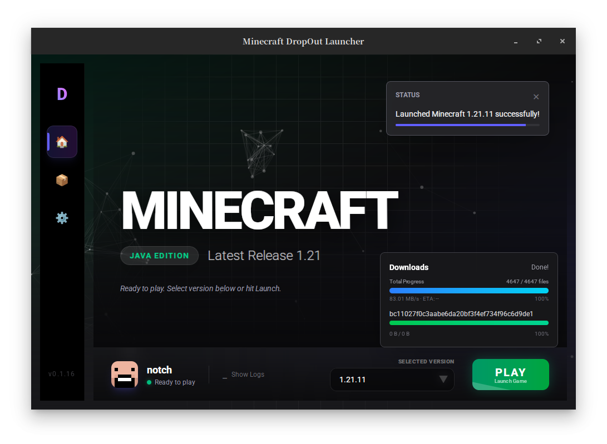

# DropOut

DropOut is a modern, fast, and efficient Minecraft launcher built with the latest web and system technologies. It leverages **Tauri v2** to deliever a lightweight application with a robust **Rust** backend and a reactive **Svelte 5** frontend.

<div align="center">
   
</div>

## Features

- **High Performance**: Built with Rust and Tauri for minimal resource usage.
- **Microsoft Authentication**: Secure login support via official Xbox Live & Microsoft OAuth flows.
- **Cross-Platform**: Native support for **Windows**, **Linux**, and **macOS**.
- **Modern UI**: Clean and responsive interface built with Svelte 5 and Tailwind CSS 4.
- **Game Management**:

  - Version isolation and management
  - Efficient asset and library downloading
  - Custom Java arguments support

## Roadmap

- [X] **Account Persistence** — Save login state between sessions
- [X] **Token Refresh** — Auto-refresh expired Microsoft tokens
- [X] **JVM Arguments Parsing** — Parse `arguments.jvm` from version.json for Mac M1/ARM support
- [X] **Java Auto-detection** — Scan common paths for Java installations
- [X] **Fabric Loader Support** — Install and launch with Fabric
- [X] **Forge Loader Support** — Install and launch with Forge (basic support)
- [X] **Version Filtering** — Filter by release/snapshot/modded in UI
- [ ] **Instance/Profile System** — Multiple isolated game directories with different versions/mods
- [ ] **Multi-account Support** — Switch between multiple accounts
- [ ] **Custom Game Directory** — Allow users to choose game files location
- [ ] **Launcher Auto-updater** — Self-update mechanism via Tauri updater plugin
- [ ] **Mods Manager** — Enable/disable mods without deletion
- [ ] **Resource Packs Manager** — Browse and manage resource packs
- [ ] **Quilt Loader Support** — Install and launch with Quilt
- [ ] **Import from Other Launchers** — Migration tool for MultiMC/Prism profiles

## Installation

Download the latest release for your platform from the [Releases](https://github.com/HsiangNianian/DropOut/releases) page.

| Platform       | Files                   |
| -------------- | ----------------------- |
| Linux x86_64   | `.deb`, `.AppImage` |
| Linux ARM64    | `.deb`, `.AppImage` |
| macOS ARM64    | `.dmg`                |
| Windows x86_64 | `.msi`, `.exe`      |
| Windows ARM64  | `.msi`, `.exe`      |

## Building from Source

### Prerequisites

1. **Rust**: Install from [rustup.rs](https://rustup.rs/).
2. **Node.js** & **pnpm**: Used for the frontend.
3. **System Dependencies**: Follow the [Tauri Prerequisites](https://v2.tauri.app/start/prerequisites/) for your OS.

### Steps

1. **Clone the repository**

   ```bash
   git clone https://github.com/HsiangNianian/DropOut.git
   cd DropOut
   ```
2. **Install Frontend Dependencies**

   ```bash
   cd ui
   pnpm install
   cd ..
   ```
3. **Run in Development Mode**

   ```bash
   # This will start the frontend server and the Tauri app window
   cargo tauri dev
   ```
4. **Build Release Version**

   ```bash
   cargo tauri build
   ```

   The executable will be located in `src-tauri/target/release/`.

## Contributing

Contributions are welcome! Please feel free to submit a Pull Request.

1. Fork the Project
2. Create your Feature Branch (`git checkout -b feature/AmazingFeature`)
3. Commit your Changes (`git commit -m 'Add some AmazingFeature'`)
4. Push to the Branch (`git push origin feature/AmazingFeature`)
5. Open a Pull Request

## License

Distributed under the MIT License. See `LICENSE` for more information.
